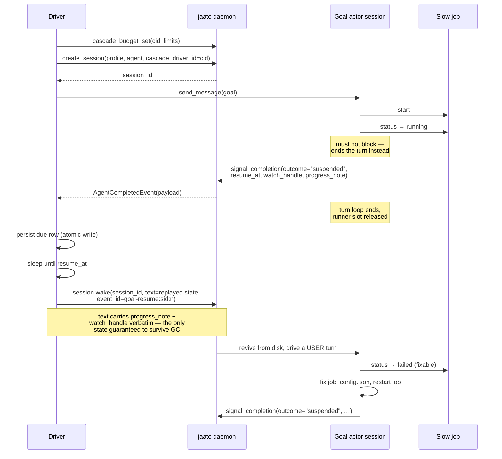

# Sequence: one suspend/resume cycle

The cycle repeats until the agent reports `outcome: "finished"`, or the cascade
budget refuses further work.

## Why `session.wake` and not attach-then-send

`signal_completion` terminates the turn loop and releases the runner slot, so by
the time the resume is due the session is usually cold. `session.wake`:

- cold-revives from disk (`resume_session` → drive) in one call;
- resolves the workspace **server-side** from the persisted record, so a caller
  cannot point revival at a weaker sandbox root;
- wraps the text as untrusted content, so the woken turn treats it as data;
- dedups on `event_id`, making a crash between waking and recording safe.

The driver passes no `cascade_driver_id` on the wake, so the daemon's
deferred-turn path (which holds a turn pending a client attach) never engages —
the driver is attached and running by definition, since it holds the clock.
